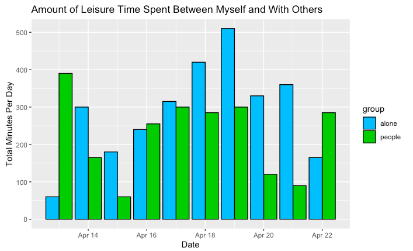

```{r setup, include=FALSE}
knitr::opts_chunk$set(echo = TRUE)
```


```{r, eval=FALSE, include=FALSE}
# you'll need to delete the eval=FALSE for this code chunk to execute
# but keep the include = FALSE so that it does not show up in the knit file (on the webpage)

library(tidyverse)
library(lubridate)
library(ical)

my_calendar <- ical_parse_df(file = "INSERT_PATH_HERE/your_user_name@amherst.edu.ics") %>%
  mutate(start_datetime = with_tz(start, tzone = "America/New_York")
    , end_datetime = with_tz(end, tzone = "America/New_York")
    , length_sec = end_datetime - start_datetime
    , length_min = length_sec/60
    , length_hrs = length_min/60
    , date = floor_date(start_datetime, unit = "day"))
```

# How Do I Spend My Time in Quarantine?
## Tracking My Time for 10 Days in Google Calendar


# Questions of Interest

Before starting this project, I intended to answer the following questions: how does sleep affect my productivity the next day, how does the time spent between each of my classes differ, and how much time do I spend on my phone/watching TV versus other activities. I set out to answer these questions but also looked at different variations of them while analyzing my data.

# Data collection

I tracked my days in Google Calendar for 10 days. Here is an example of part of a day I tracked:


I tried to make my calendar summaries concise but with different attributes so I could make more meaningful graphs. For example, when describing what work I did, I wrote the class name (Data Science, Micro, Public Choice) and the category of work (Zoom, pre-recorded lecture, work). For my leisure time, I added a one word description like "Phone" or "workout" and if I did something with my sister or family I included that too.

# Results
## Leisure Time

In terms of tracking my leisure time, I wanted to gain insight into how much time I was spending doing screen/non-screen activities. I first looked at my overall leisure time and how it was spent by filtering my calendar data set for terms like “phone,” “TV,” “workout,” “outside,” etc. I created a basic bar graph to visualize my overall minutes spent on these activities and saw that phone was considerably higher than all other activities, with TV right behind it. These numbers weren’t incredibly meaningful since they were total minutes over the 10 days, but they were able to show that I did spend the most leisure time on screen. "Playing outside" means playing field hockey in my backyard-I just wanted the summaries to be as concise as possible. "Phone set up" was setting up my new phone-so another reason why my phone time was so high was because I just got a new phone (and didn't have one for 7 weeks).  


Next, I created new datasets and graphs to visualize exactly how many minutes of the day my leisure time was spent doing screen/non-screen activities and alone/with other people. My screen and non-screen leisure time for the most part both had the same trend-increasing as the week went on and then decreased, though screen time was always higher. The similar trends can be attributed to the fact that my total leisure time increases as the week goes on since I have more time on Friday-Sunday to do non-school related things. My screen time was highest on Sunday at 550 minutes because it was the end of the week and I had no more work to do. This number in reality should probably be higher since I didn’t track every single time I picked up my phone, I only tracked “phone” if I was on it for an extensive amount of time. 
My graphs that showed proportions of how daily leisure time was spent show that my highest non-screen proportion of leisure time (55%) was on Thursday, and this was because I finished my Micro midterm and probably wanted to do other activities besides look at a screen. 


Alone time and time with others (in terms of leisure time) didn’t seem to have similar trends, or any trends at all. My alone time was highest on Saturday and Sunday, with 520 minutes on Sunday, which was interesting because I thought I would have more time with my family on those days. However, my time with other people was also higher, meaning my leisure time was just overall higher on the weekend. 
Surprisingly, my highest proportion of leisure time with people (80%) was on the first Monday, and this day was spent studying for Micro so I am not sure why I was with my family for so much time. I probably had less leisure time overall that day so the proportion became higher.

 


## Class Time
Next, I wanted to look into how my time differed among each of my classes. My work for Greek Mythology class was sporadic and mostly just slight reading every so often so I decided to just track my time between Micro, Data Science, and Public Choice. I made pie charts showing proportions of work spent on each class each day which show that overall I spent the most time on Micro in the beginning of the week. On Monday Micro was 100% of the work and on Tuesday it was 75%. This is because I tend to watch my Micro lectures at the beginning of the week and I also had a midterm for it on Wednesday. Thus, later in the week I had 100% time spent on Data Science on Saturday and 100% on Public Choice on Sunday since I didn’t have any more Micro work due. 

 

I then looked at the kind of work I did each day. My pie chart showing overall time spent on each category of work (pre-recorded lecture, zoom, work) over the 10 days shows that I spent the most time on work (55%), and only 7% on zoom. I only use zoom for Data Science and Micro once a week which is why it was the lowest. 100% of April 22 was lecture because my only class is a pre-recorded Public Choice lecture on Wednesday. Zoom was only on Thursday since that is when I have Data Science and Micro. 

 

 

Overall, I seemed to do the most work Monday-Thursday since I was studying most of the day for Micro. My total hours of work per day decreased during the weekend and then increased again on Monday.

 

## Sleep vs. Work

Lastly, I looked at my sleep versus work done that day. I created a line graph showing how many hours of sleep and work I had that day to visualize this. Overall, there wasn’t much of a connection. When I had the most sleep (9 hours) on Monday, I worked for 4.6 hours while on Tuesday I had 7 hours of sleep and worked for 6 hours. However, this information doesn’t convey the quality of my work, and my work time was also higher on Tuesday solely because I was trying to study for Micro. My sleep was also the highest (9 hours) on Saturday and I had the least amount of work (0.5 hours), but this was because it was the weekend and I slept in.

 

Overall, my findings can’t really be applied to the rest of my time in quarantine because I spent an excessive amount of time on Micro that week because I had a midterm and additionally had to watch very long lectures. I probably did more work in these 10 days than I usually do. Ignoring sleep, I spent the most overall time on work, then on leisure (not including phone time), then on my phone. Tik tok overall time was not as high as I thought it would be, but it was a large proportion of my leisure time. I learned that I spend a huge amount of my leisure time on a screen, even though I thought that I spend a lot of time working out and going outside. 

 

This makes me want to increase my non-screen leisure time, and now that the weather is getting nicer I can. 

Overall, my data did show what I expect-my leisure time increased as the week went on and my work was highest at the beginning of the week. Sleep versus productivity is something that is hard to track so I didn’t find out much about the relationship. I also sometimes thrive off of no sleep so it is hard to reflect on that. I also found that I spent more of my leisure time alone as the week went on, but this could be because I go on my phone for more time when I don’t have work, or just because I have higher overall leisure time on the weekend.

## Reflection

The overall process of wrangling the calendar data was interesting but definitely difficult at times. It wasn’t as much wrangling as the Clearinghouse Challenge, though my calendar summaries made it so I had to make a ton of new datasets and rename summaries to make them simpler. It was similar to the Clearinghouse Challenge in that I had to filter for summaries like we had to filter for college degrees, but it was definitely much easier to find my calendar summaries than the degrees. The process was very informative and helped me become more comfortable with data wrangling and it was interesting to look so deeply into my quarantine days.

When giving my data to Google, my expectations are that I don’t want to overshare information because they see everything we give them, so in this project, I only wrote very short 1-2 word descriptions in my calendar input. Overall, in terms of giving my data to these apps, my expectations are the same-that they have total access to all our information and we have to be careful. 
As someone who analyzes other people’s data, our legal and ethical responsibilities include not doing anything with the data (like saving it or sending it out to people), not discussing what data points are specific people (this violates their privacy), and having consent from the organization to use and look at the data. It's also important that we don't violate these responsibilities or misuse the application when using Google, Facebook, etc.


