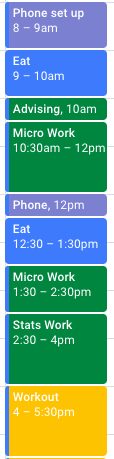

How Do I Spend My Time in Quarantine?
=====================================

Tracking My Time for 10 Days in Google Calendar
-----------------------------------------------

\#\#\#Questions of Interest Before starting this project, I intended to
answer the following questions: how does sleep affect my productivity
the next day, how does the time spent between each of my classes differ,
and how much time do I spend on my phone/watching TV versus other
activities. I set out to answer these questions but also looked at
different variations of them while analyzing my data.

I tracked my days in Google Calendar for 10 days. Here is an example of
part of a day I tracked:

Create a “img” folder within your calendar-project repo and store the
image files there.

Data collection
===============

I collected data by . . .

I can write a bulleted list like this:

-   here’s the first thing I want to say
-   and I also want to say this
-   lastly, this

And a numbered list like this:

1.  First thing
2.  Second thing
3.  Third thing

Results
=======

And here are my results . . .

    # intersperse relevant figures and text
